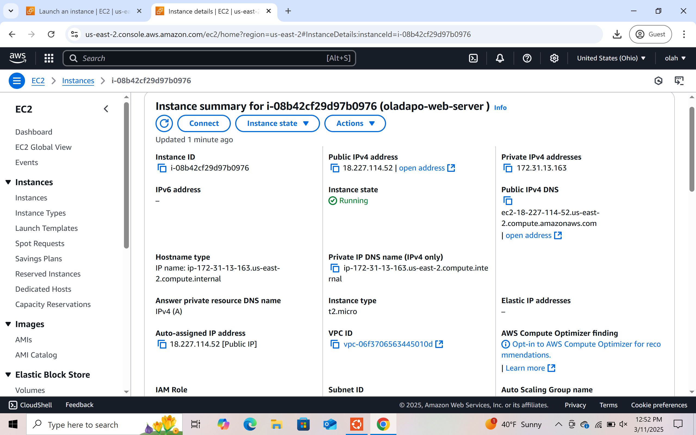
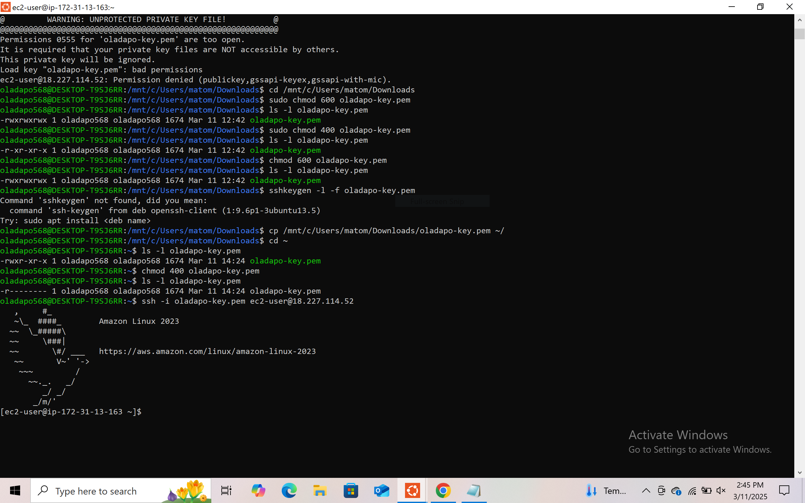
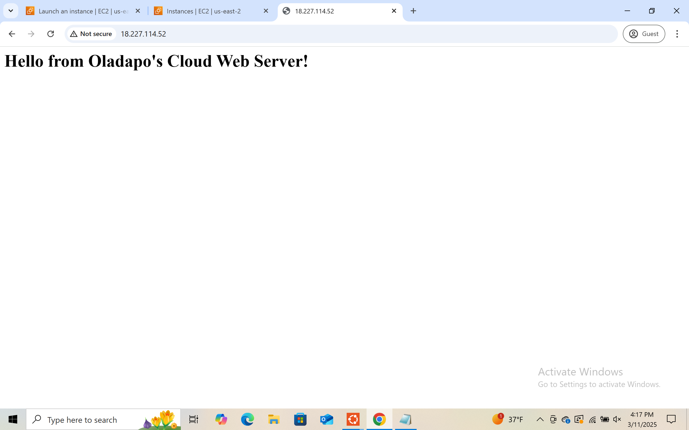

# 🌐 AWS EC2 Apache Web Server Project

This is a hands-on project where I launched an EC2 instance on AWS, connected via SSH, installed and configured Apache, and deployed a live HTML page from the cloud.

> 📄 View the full PDF report: [Oladapo_EC2_Web_Server_Project_StepByStep_Cleaned.pdf](./Oladapo_EC2_Web_Server_Project_StepByStep_Cleaned.pdf)

---

## 🚀 Step 1: Launch EC2 Instance

I created a t2.micro EC2 instance using the Amazon Linux 2023 AMI in the us-east-2 (Ohio) region.

**Security Group configuration:**
- SSH (port 22) for terminal access
- HTTP (port 80) for web traffic

**Key pair:** `oladapo-key.pem`



---

## 🔐 Step 2: Connect to Instance via SSH

When I tried connecting via SSH, I encountered **two major issues**.

### ❌ Issue 1: Permission Denied (publickey)

**Error:**
```
UNPROTECTED PRIVATE KEY FILE!
Permission denied (publickey)
```

**Fix:**
```bash
chmod 400 oladapo-key.pem
```

### 📂 Issue 2: PEM File Not Found in Ubuntu Downloads

The PEM file was saved in Windows Downloads but not found by Ubuntu.

**Fix:**
```bash
cd /mnt/c/Users/YourWindowsUsername/Downloads
cp oladapo-key.pem ~/
chmod 400 ~/oladapo-key.pem
```

### ✅ Final Connection Command
```bash
ssh -i ~/oladapo-key.pem ec2-user@18.227.114.52
```



---

## 🛠️ Step 3: Update the Instance and Install Apache

```bash
sudo yum update -y
sudo yum install httpd -y
sudo systemctl start httpd
sudo systemctl enable httpd
```

---

## 🌍 Step 4: Deploy the HTML Web Page

Navigate to the web root and create an `index.html` file:

```bash
cd /var/www/html
sudo nano index.html
```

**HTML Content:**
```html
<h1>Hello from Oladapo's Cloud Web Server!</h1>
<p>This web page is hosted on an AWS EC2 instance using Apache.</p>
```

---

## ✅ Step 5: Access the Live Website

Website URL:  
[http://18.227.114.52](http://18.227.114.52)



---

## 💡 Skills Demonstrated

- AWS EC2 provisioning and key pair setup
- SSH access and Linux permissions
- Apache web server installation on Amazon Linux
- Troubleshooting real-world SSH and PEM issues
- HTML deployment and web hosting
- Configuring security groups and networking

---

## 📁 Files Included

- `Oladapo_EC2_Web_Server_Project_StepByStep_Cleaned.pdf` – Full PDF report
- `EC2-instance-running.png` – Screenshot of EC2 instance
- `EC2_SSH_Connection.PNG` – Screenshot of SSH access
- `Setup_Web_Server_on_Ec2.PNG` – Screenshot of live web page

---

## 👤 About Me

**Oladapo Adenekan**  
Cloud & DevOps Enthusiast  
📍 Ohio, USA  
🔗 [LinkedIn](https://www.linkedin.com/in/oladapo568)

---

⭐ Feel free to fork, clone, or reference this project. It reflects my hands-on experience and passion for cloud engineering!


